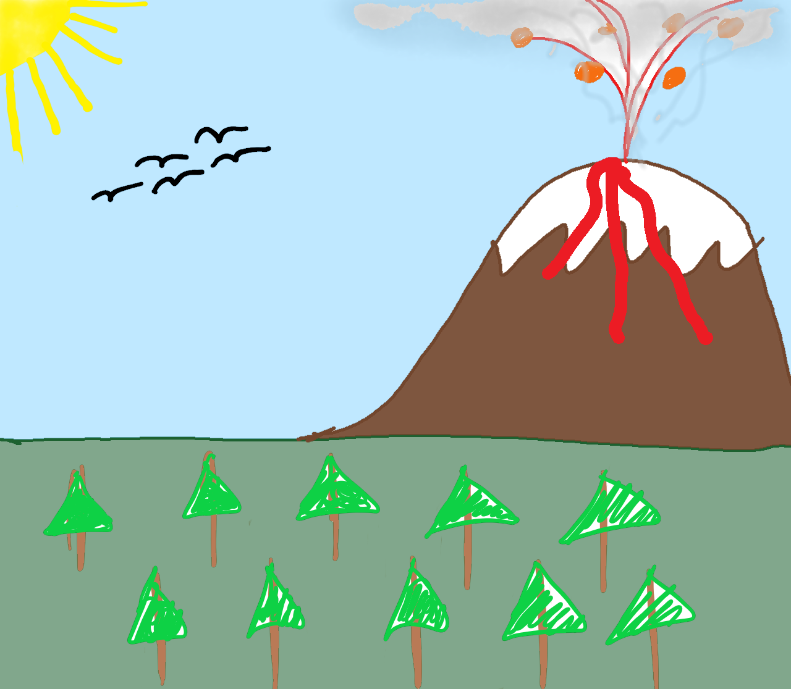

# SuperCoolWeatherApp

Super Cool Weather App is... a super cool weather app that enables anyone to look up the current
weather and 7-day forecast for any location in the United States.
## Prerequisites
Before you begin, makes sure you've done the following:
* Installed the [latest version of java](https://www.java.com/en/)

If you simply want to run the program, then you should be set! Simply download and run
`SuperCoolWeatherApp.jar`.

If you want to build the application from scratch, you'll need a little bit more:
* Java JDK 8 or above
* Maven
* Preferably Intellij Idea to build the `.jar` file, because I don't know how to do it with maven
  alone.

## Building From Scratch
The program requires a google cloud API key to access Google's Geocoding API. For security purposes,
this is obscured on Github, and you will have to generate your own. For more help with obtaining a
Google Cloud API key, [click here](https://cloud.google.com/apis/). After you get an API key, you
need to make a file in `~/src/main/java/com/JanzEvie/supercoolweatherapp` called `ApiKey.java`. Inside, simply paste the following
code, with your API key replacing the question mark.
```java
package com.JanzEvie.supercoolweatherapp;

public class ApiKey {
    public static String key = "?";
}
```

To build the `.jar` file from scratch, follow these directions:
* clone the repo and import the directory as a Maven project.
* File->Project Structure->Artifacts
  * Add JAR from modules with dependencies->select UserInterface as main class->OK
* Build->Build artifacts->Build
* Enjoy!

## Using the Super Cool Weather App
Using the super cool weather app is simple. Simply run the `.jar` file, and a window will appear. At
the top, enter the location you wish to get weather forecasts for. It can be an address, point of
interest, or general region, as long as its somewhere in the United States (The National Weather
Services only records data for the U.S.—go figure). No need to make sure it's formatted right; our
fancy shmancy code takes care of that for you.

Currently you have three options once you put in a location: you can get the current temperature,
the day's overall forecast, or the predicted weather for the next seven days.

## Contributors
This program was created by Jacob Janz and Evie Boland, two undergrads at Georgetown University, at
Hoyahacks 2020. For our first time at a hackathon, we're both pretty pleased.

* [@JanzCS](https://github.com/JanzCS)
* [@Eab148](https://github.com/Eab148)

## Acknowledgements
I don't know how to do this right, but here's a list of the useful libraries and services we used:
* [Google Cloud Geocoding API](https://developers.google.com/maps/documentation/geocoding/start)
* [Java Swing Library](https://en.wikipedia.org/wiki/Swing_(Java))
* [National Weather Service Forecast Data API](https://www.weather.gov/documentation/services-web-api)
* [Unirest Java HTTP Client Library](http://kong.github.io/unirest-java/)

We'd also like to acknowledge our parents and stuff. Thanks, y'all.
